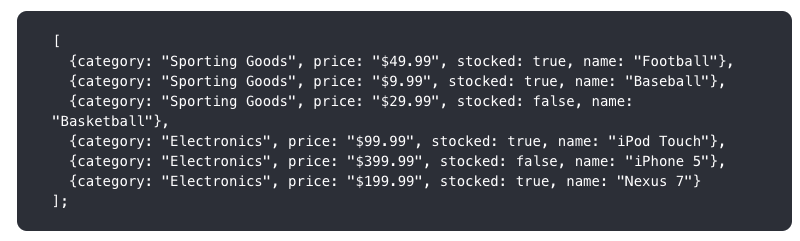

# Developing With Golgi: A Comparison With React.js

This tutorial is based around one of the well-known, documented React Examples: [**Thinking in React**](https://reactjs.org/docs/thinking-in-react.html).  

In this first Chapter of the tutorial, we'll demonstrate how to use Golgi's basic functionality to implement the same example, and in doing so, you can compare this with how you'd have used React instead.

You'll see some key similarities between the technologies:

- Golgi and React both represent an application as a hierarchy of Components.  However, unlike React's third-party implemention of Components, Golgi uses WebComponents which are natively supported by all modern browsers.

- Golgi uses XML (known as *gx*) to represent an Assembly of components; React uses *JSX* to do effectively the same thing

- Golgi can use *gx* attributes as the equivalent of React *props* to pass data down into sub-components.

However, there are some key differences:

- Golgi uses the real or Shadow DOM; React uses a virtual DOM
- Golgi does not force you into a one-way flow of information
- Golgi does not have the same concept of state as React, and does not trigger a re-rendering of a component and its descendant Components when/if its state changes
- Golgi provides a proxy object-based mechanism for binding state to properties within components
- Golgi provides an automated mechanism, based around MutationObservers for triggering custom behaviour due to state changes within components
- Golgi is built around WebComponents which are supported natively by all modern browsers, and only requires a very small JavaScript module (*golgi.js*) in order to work.  By comparison, React requires you to load a very large set of dependencies which implement React's own third-party Components.
- Golgi does not require a bundling/compilation step: Golgi resources are loaded dynamically on-demand into the browser.  There's no need for large, complex build chains.  Just develop and go!

So let's see this in action, and let's see how to think in Golgi's terms when building an application.

# Start With the Mock

Here's the mock that is used in the **Thinking in React** example, and that we'll also use in this tutorial:

  

We'll also use the same JSON data structure to populate our UI:

  

# Step 1: Break The UI Into A Component Hierarchy

The first step is just the same as when using React, and we can simply 
[follow the guidance provided in the React example](https://reactjs.org/docs/thinking-in-react.html#step-1-break-the-ui-into-a-component-hierarchy)

So we'll use the same breakdown of components to represent the mock:

  

with each number representing the following logical units:

1. *filterable-product-table* (orange): contains the entirety of the example
2. *searchbar* (blue): receives all user input
3. *product-table* (green): displays and filters the data collection based on user input
4. *product-category-row* (turquoise): displays a heading for each category
5. *product-row* (red): displays a row for each product

The hierarchical structure of these units is:

- filterable-product-table
  - searchbar
  - product-table
    - product-category-row
    - product-row (repeated for each product in the category)

So far, the analysis is identical to React, but Unlike in React, in Golgi, we need to distinguish between:

- the baseline units that represent actual markup and associated behaviour within the UI, and that will be represented as Golgi WebComponents
- top-level and intermediate units that denote an *assembly* of Golgi Components, potentially with associated behaviour

So we can conclude from the hierarchy above that we'll need four Golgi Components:

- searchbar
- product-table
- product-category-row
- product-row

and one Golgi Assembly:

- filterable-product-table

  This will consist of *gx* that represent the *searchbar* and *product-table* Components.

Additionally we can conclude that the *product-table* Component will need to dynamically populate its rows and columns from a PRODUCT array.

# Step 2: Create our Project Structure

There are no hard and fast rules to this step in Golgi, and you can adapt how I'd do it to your taste.

A key feature of Golgi is that there is no build/bundling step, and no need for any build tools or build chain.

What you **do** need, however, is access to a working Web Server which will fetch your Golgi Components into your browser.  Golgi Components and Assemblies are packaged as ES6 Modules, which means they can be handled completely dynamically.

You can use any Web Server with Golgi, eg you could use NGINX or Apache, or you could use something like Express or Fastify within a Node.js system - it's entirely up to you.  Whatever Web Server you use, you need to create a folder/directory on your Web Server's system and map its physical path to an appropriate Web Server alias path: how you do this will depend on the Web Server.

I'm going to assume you've set up a physical directory named *example*, eg *C:\example* or */opt/nginx/www/example* and that the URL path you'll use in the Web Server to fetch resources from this directory is */example*.

Within this *example* folder, I'll create the following sub-directory structure:

        example
          |
          |- js
          |   |
          |   |- assemblies
          |   |
          |   |- components
          |   |       |
          |   |       |- productui
          |   |       |       |
          |   |

## Install the *Golgi* Module

You need to get a copy of the [Golgi module](src/golgi.js) and place it in the */example/js* folder.

During development, you may wish to use this full source version, but for production, I'd recommend using the
much smaller but functionally identical [minified version](src/golgi.min.js).

## Create an *app.js* Module

The next step is to create the basic Golgi Application module that configures and kick-starts everything.

        (async () => {

          const {golgi} = await import('./golgi.js');

          let context = {
            componentPaths: {
              productui: './components/productui/'
            },
            assemblyPath: './assemblies/'
          };

          await golgi.renderAssembly('filterable-product-table', 'body', context);
          
        })();

Save this as */example/js/app.js*

Note: we'll create the *filterable-product-table* Assembly Module file that this refers to in a later step.

## Create an *index.html* File.

Next, create a minimal "bare-bones" HTML page that will start your example application by loading the *app.js* module into the browser:

        <!DOCTYPE html>
        <html lang="en">
          <head>
            <title>Product UI Example</title>
          </head>
          <body>
            
          </body>
        </html>

Save this as */example/index.html*

So you should now have the following structure for your project:

        example
          |
          |- index.html
          |
          |- js
          |   |
          |   |- assemblies
          |   |
          |   |- components
          |   |       |
          |   |       |- productui
          |   |       |       |
          |   |
          |   |
          |   |- app.js
          |   |
          |   |- golgi.js

# Step 3: Build Out the Golgi Components

The next step is to build an initial basic version of each of the four Golgi Components that we need for the product user interface.  

We won't add all their required functionality just yet, but essentially enough to correctly render their HTML markup.

We'll create each of these within the */example/js/components/productUI* folder

Golgi Components must have a hyphenated prefix in their name, and their names must be all lower-case.  This is because they are WebComponents, and also to allow Golgi to locate them.  If you look at this part of the *app.js* module you created earlier:

          let context = {
            componentPaths: {
              productui: './components/productui/'
              ...

This is telling Golgi that any WebComponent with a prefix of *productui-* will be found in and must be imported from the */components/productui* subfolder.

So, for our product user interface example, all our Golgi Components are going to have a prefix of *productui-*.

A Golgi Component is essentially a stripped-down WebComponent, wrapped as an ES6 module.  You'll see below that you don't need to worry about any of the standard WebComponent lifecycle methods: Golgi augments each of your Components automatically to provide all the equivalent lifecycle functionality, and a lot more besides.

So, shown below are initial, basic versions of each of the Golgi Components you'll need for the Product UI example application:

## productui-searchbar Component

Copy and save the following to a file named */example/js/components/productui/productui-searchbar.js*

        export function load() {

          let componentName = 'productui-searchbar';
          
          customElements.define(componentName, class productui_searchbar extends HTMLElement {
            constructor() {
              super();
              const html = `
        <input type="text" placeholder="Search..." />
        

          <input type="checkbox" />
          &nbsp;Only show products in stock
        

              `;
              this.html = `${html}`;
            }
          });
        };

Note that this "bare-bones" version doesn't yet include any dynamic behaviour: we'll show how to do that later.

## productui-table Component

Copy and save the following to a file named */example/js/components/productui/productui-table.js*

        export function load() {

          let componentName = 'productui-table';
          
          customElements.define(componentName, class productui_table extends HTMLElement {
            constructor() {
              super();
              const html = `
        <table>
          <thead>
            <tr>
              <th>Name</th>
              <th>Price</th>
            </tr>
          </thead>
          <tbody golgi:prop="tbody"></tbody>
        </table>
              `;
              this.html = `${html}`;
            }

            async populate(PRODUCTS) {
              let categoryFound = {};

              for (const [index, product] of PRODUCTS.entries()) {
                if (!categoryFound[product.category]) {
                  categoryFound[product.category] = true;
                  let crow = await this.renderComponent('productui-category-row', this.tbody, this.context);
                  crow.setState(product);
                }
                let row = await this.renderComponent('productui-row', this.tbody, this.context);
                row.setState(product);
              }
            }

          });
        };

Note that this Component includes a custom method - populate() - which will be used to populate the table.

## productui-category-row Component

Copy and save the following to a file named */example/js/components/productui/productui-category-row.js*

        export function load() {
            
          let componentName = 'productui-category-row';
            
          customElements.define(componentName, class productui_category_row extends HTMLElement {
            constructor() {
              super();
              this.attachShadow({ mode: 'open' });
              const html = `
        
        

              `;
              this.shadowRoot.innerHTML = `${html}`;
            }

            setState(state) {
              if (state.category) {
                this.rootElement.textContent = state.category;
              }
            }
           
          });
        };

Notes:

- in this Component, we need to use specific CSS styles, so we'll enable and use Shadow DOM.

- because the parent tag of a *TR* tag can only be *TABLE*, *THEAD* or *TBODY*, we're instead defining the row using a *DIV* tag and styling it as a *table-cell* display type, and styling the Component's Shadow DOM *host* element as a *table-row* display type.  As a result we can use this Component to generate what will be treated as a table row and associated cells.

- as this Component has only a single main HTML tag - *div* - Golgi automatically defines it as *this.rootElement*.

- we've added a *setState()* method that we can use to display the category type.  

## productui-row Component

Copy and save the following to a file named */example/js/components/productui/productui-row.js*

        export function load() {

          let componentName = 'productui-row';
          
          customElements.define(componentName, class productui_row extends HTMLElement {
            constructor() {
              super();
              this.attachShadow({ mode: 'open' });
              const html = `
        
        

        

              `;
              this.shadowRoot.innerHTML = `${html}`;
            }

            setState(state) {
              if (state.name) {
                this.name.textContent = state.name;
              }
              if (state.price) {
                this.price.textContent = state.price;
              }
              if (state.stocked) {
                this.name.style = 'color: black;';
              }
              else {
                this.name.style = 'color: red;';
              }
            }

          });
        };

Notes:

- in this Component, we need to use specific CSS styles, so we'll enable and use Shadow DOM.

- because the parent tag of a *TR* tag can only be *TABLE*, *THEAD* or *TBODY*, we're instead defining the row using a *DIV* tag and styling it as a *table-cell* display type, and styling the Component's Shadow DOM *host* element as a *table-row* display type.  As a result we can use this Component to generate what will be treated as a table row and associated cells.

- as this Component has multiple *div* tags, we'll use the special *golgi:prop* attribute to instruct Golgi what property name to assign to each *div* - in this case *this.name* and *this.price*, which will allow us to locate the respective *div* elements later. 

- we've added a *setState()* method that we can use to populate and style the cells in each row.

# Step 3: Build Out the Golgi Assembly

The next step is to build the top-level Golgi Assembly Module:

## filterable-product-table

Copy and save the following to a file named */example/js/assemblies/filterable-product-table.js*

        export function load() {

          let gx=`
        <productui-searchbar />
        <productui-table golgi:hook="initialise" />
          `;

          let hooks = {
            'productui-table': {
              initialise: function() {
                let PRODUCTS = [
                  {category: 'Sporting Goods', price: '$49.99', stocked: true, name: 'Football'},
                  {category: 'Sporting Goods', price: '$9.99', stocked: true, name: 'Baseball'},
                  {category: 'Sporting Goods', price: '$29.99', stocked: false, name: 'Basketball'},
                  {category: 'Electronics', price: '$99.99', stocked: true, name: 'iPod Touch'},
                  {category: 'Electronics', price: '$399.99', stocked: false, name: 'iPhone 5'},
                  {category: 'Electronics', price: '$199.99', stocked: true, name: 'Nexus 7'}
                ];
                this.populate(PRODUCTS);
              }
            }
          };

          return {gx, hooks};
        };

Notes:

- a Golgi Assembly is defined as an ES6 Module.

- the *gx* lines define the Golgi Components that we want to render in this assembly, in this case:

  - productui-searchbar
  - productui-table

- the *gx* for the *product-table* Component specifies that Golgi should invoke a *hook* method  - *initialise()* - after it has rendered.

- the *initialise()* method for the *product-table* Component is defined in the *hooks* object:

  - we're going to use it to hard-code the *PRODUCTS* array
  - we're then going to invoke the *productui-table*'s *populate()* method which will populate the table's rows using the information in the *PRODUCTS* array.

- both the *gx* variable and *hooks* object must be exported from the module as shown.

# Run the Application

We should now be ready to run the application in the browser. All we need to do is load the *index.html* page into the browser, eg:

        http://localhost:3000/example/

or:

        http://localhost:3000/example/index.html

if you need to explicitly specify the page name.

You should see the expected results:

  

# How and Why Did the Golgi Application Work?

Let's step through what just happened:

- you loaded the *index.html* file into the browser.  It imported and invoked the *app.js* module as a result of this line:

        

- the *app.js* module:

  - imported the *golgi.js* framework module:

        const {golgi} = await import('./golgi.js');

  -  defined the paths used by Golgi to locate your assembly and component modules:

        let context = {
          componentPaths: {
            productui: './components/productui/'
          },
          assemblyPath: './productui_assemblies/'
        };

  - instructed Golgi to import and render your *filterable-product-table* Assembly module, attaching it to the *body* tag of your *index.html* page:

        await golgi.renderAssembly('filterable-product-table', 'body', context);

- the *filterable-product-table* Assembly module rendered two Golgi WebComponents:

  - productui-searchbar
  - productui-table

- on rendering the *productui-table* Component, a *hook* method - *initialise()* - was invoked by the Assembly:

        <productui-table golgi:hook="initialise" />

- the *initialise()* hook method defined the *PRODUCT* array and passed it into the *productui-table* Component's *populate()* method:

        let PRODUCTS = [
          {category: 'Sporting Goods', price: '$49.99', stocked: true, name: 'Football'},
          {category: 'Sporting Goods', price: '$9.99', stocked: true, name: 'Baseball'},
          {category: 'Sporting Goods', price: '$29.99', stocked: false, name: 'Basketball'},
          {category: 'Electronics', price: '$99.99', stocked: true, name: 'iPod Touch'},
          {category: 'Electronics', price: '$399.99', stocked: false, name: 'iPhone 5'},
          {category: 'Electronics', price: '$199.99', stocked: true, name: 'Nexus 7'}
        ];
        this.populate(PRODUCTS);
      }

- the *productui-table* Component's *populate()* method iterated through the *PRODUCTS* array, and rendered:

  - a *productui-category-row* Component for each new category value that it finds, appending it to the *productui-table*'s *TBODY* tag.  The *product* object found at each iteration was used to set the state of the *product-category-row* component:

        if (!categoryFound[product.category]) {
          categoryFound[product.category] = true;
          let crow = await this.renderComponent('productui-category-row', this.tbody, this.context);
          crow.setState(product);
        }

   The *category* property of the *product* object was used to define the table cell's *textContent*:

        setState(state) {
          if (state.category) {
            this.rootElement.textContent = state.category;
          }
        }

   *this.rootElement* refers to this tag within the *product-category-row*'s markup:

        

  - a *productui-row* Component for each *product* object within the *PRODUCTS* array, appending it to the *productui-table*'s *TBODY* tag.  The *product* object found at each iteration was used to set the state of the *product-row* component:

        let row = await this.renderComponent('productui-row', this.tbody, this.context);
        row.setState(product);

   The *name* and *price* properties of the *product* object were used to define the table cells' *textContent*, while the *stocked* property was used to style the *name* cell:

        setState(state) {
          if (state.name) {
            this.name.textContent = state.name;
          }
          if (state.price) {
            this.price.textContent = state.price;
          }
          if (state.stocked) {
            this.name.style = 'color: black;';
          }
          else {
            this.name.style = 'color: red;';
          }
        }

    *this.name* and *this.price* refer to these tags within the *productui-row* Component's markup, as a result of the special *golgi:prop* attributes:

        

        

And, as a result, the desired output is generated!

# Adding the Application's Interactive Behaviour

So far we've just implemented the basic display-only functionality of the Example Application.

Now read [Chapter 2](./GOLGI_CF_REACT_2.md) to find out how to add the Example Application's intereactive filtering behaviour.
